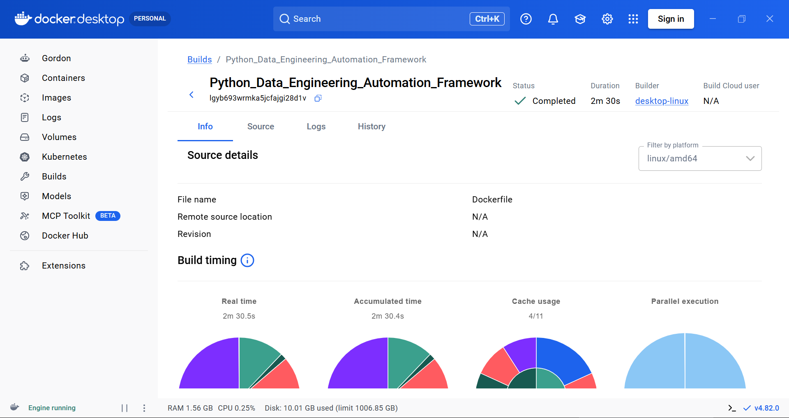
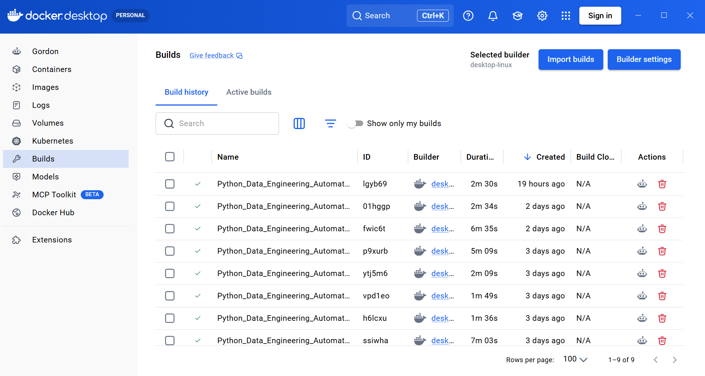
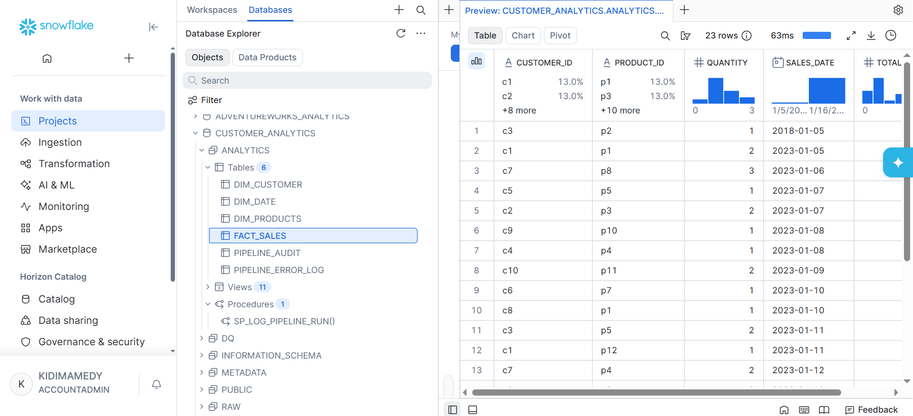
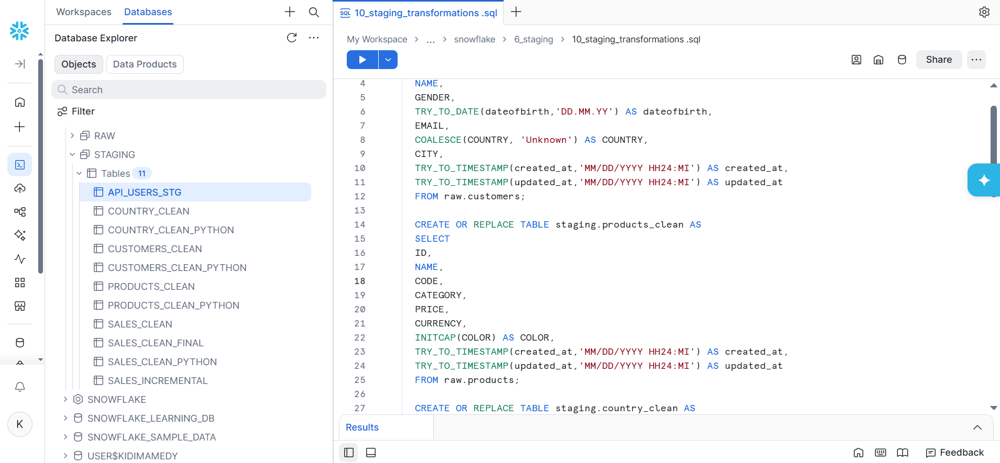
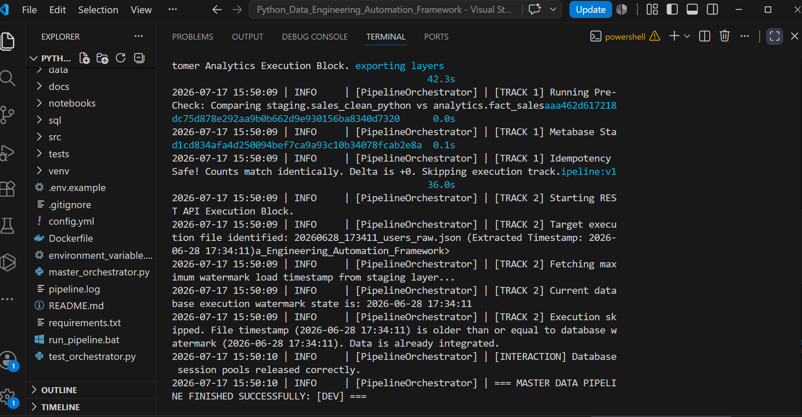
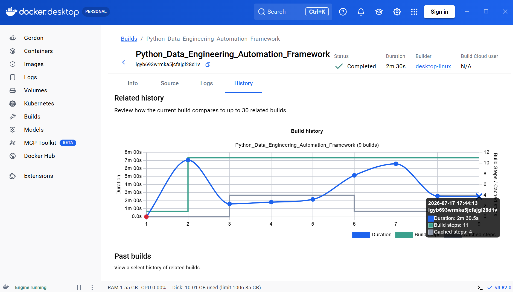
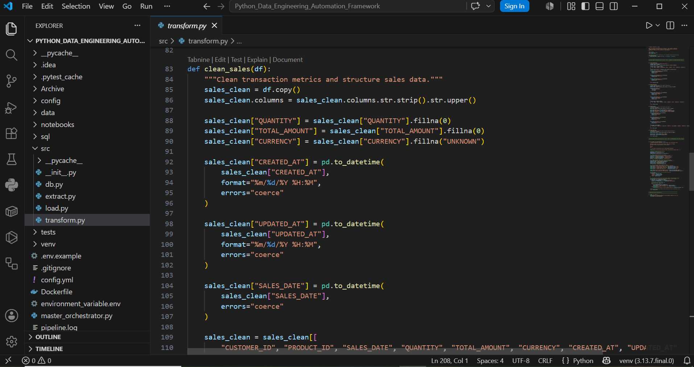

Author: Kidima Medy Masuka 

Date: 2026

---

# 🚀 Python Data Engineering Automation Framework 


## Questions 

### why are calling it a framewrork
 ✅ we are calling it a framwework because we are designing this entire project 
 following the design principles of modular python programming, where by we have
 different modules serving different reponsibilities

### why are tring to achieve in this framework
 ✅ we want to showcase how to build etl/elt pipelines by using advanced python automation
 structred logging, and snowfale inttegration, secrets management

### what is the main diffrence between python automation and python data enginering

✅ They are deeply intertwined, but they focus on two completely different goals. 
 Advanced Python Automation as how we built our machine, and Python Data Engineering is what our machine is specifically processing and protecting. or advanced python automation is about software architecture, resource efficiency, and making scripts smart enough to handle environments on their own, while python ngneering is strictly about data integrity, schema enforcement, and cost optimization inside a analytics database. Even if a script is perfectly automated, it isn't "Data Engineering" unless it actively governs data behavior. 


### why are we using docker 

✅ We use Docker to package our entire Python data engineering automation framework into an isolated, portable container. This ensures the application runs consistently across different computers and environments, eliminating dependency conflicts and the common "it works on my machine" problem.

---

### Architecture and Data Flow Paradigm

The framework implements a hybrid pipeline topology commonly referred to in industry as an **EtLT (Extract, transform, Load, Transform)** workflow, split across two decoupled data processing tracks:

---

## Project Overview

This project establishes a robust, enterprise-grade data automation framework designed to execute hybrid ELT and ETL data pipelines via a modular Python system. By decoupling configuration from code and leveraging environment-based configurations with RSA key-pair authentication, this Docker-containerised framework eliminates fragile, hardcoded scripts to securely ingest, stage, and load CSV and REST API data sources into Snowflake. Furthermore, the system ensures pipeline idempotency and operational resilience by implementing isolated secrets management, structured dual-handler logging, automated self-healing network retries, and Pandas-based workflows that clean, validate, extract, and timestamp datasets prior to secure database loading.

---

🛠️ Continuous Integration & Verification Framework

The entire pipeline is verified using a local pytest unit test suite and packaged into a secure, portable Docker environment utilizing runtime volume mapping to ensure zero-risk handling of private cryptographic authentication keys.To bridge local development and cloud production, the repository deploys a Single-Stage Unified CI/CD Workflow powered by GitHub Actions. This automated quality gate functions as a two-stage security filter to guarantee absolute framework durability:

Stage 1: Unit Testing Gate (Isolated Validation)Executes the full pytest suite inside an isolated cloud runner. It intercepts database targets using unittest.mock to validate Python logic, schema mutations, and parsing algorithms in local memory with zero compute costs.

Stage 2: Integration Testing Gate (Live Schema Verification)Upon unit test success, the runner securely decodes encrypted GitHub Secrets to reconstruct the private RSA key (rsa_key.p8) in-memory. It verifies production network routing and executes compilation checks directly against live Snowflake staging schemas.Idempotent State ProtectionBecause the framework utilizes metadata-driven watermarks and real-time catalog checks, the integration test verifies live connections safely without polluting production state. The runner confirms system health and safely skips data loads before destroying temporary keys.

---

## Tracks or datasets used in this automation framework

### 🏁 Track 1: Hybrid ETL/ELT Ingestion, Modeling, and Audit Framework

* ** In-Memory Transformation (ETL Phase): ** Extracts local raw datasets, forces headers to uppercase, standardises datetime attributes to UTC formats, and yields cleaned dataframes (sales_clean_python, products_clean_python, country_clean_python, and customers_clean_python) to reshape data before database arrival

* ** Idempotent Ingestion: ** Leverages a lightweight metadata helper function alongside an explicit SQLAlchemy with engine.begin() as conn: transaction context manager. This ensures the pipeline scans the Snowflake catalog and safely skips uploads if data exists, bypassing the text-syntax risks and warehouse compute inflation of to_sql(method="multi") on repetitive re-runs

* ** Downstream SQL Modeling & Transformation (ELT Phase): **  Once data successfully lands in the database staging layer, processing shifts completely to an ELT model, handing execution control to the Snowflake data warehouse to run a specialized database transformation suite sequentially:

`01_Run data quality checks.sql` - Validates staging schema records and data integrity boundaries.
`02_build_fact_table.sql` - Constructs the primary centralized metrics fact layer.
`03_build_dimension_tables.sql` - Populates the tracking dimension tables.
`04_create_analytics_views.sql` - Exposes clean reporting views for business consumption.
`05_run_stored_procedure.sql` - Executes the final compiled database audit sequence.

✅ Zero-Trust Data Quality Ecosystem: The audit calculated a net delta of 0 between the input introduced at staging and the output generated in the final analytics fact table, proving that the downstream audit ran flawlessly and no data was corrupted, drifted, or lost during transformation. Even though Staging Idempotency and Downstream Auditing are completely different mechanisms—one guarding against technical replication errors at gate-entry and the other monitoring data/processing drift inside the warehouse—running both side-by-side establishes a true zero-trust pipeline where you never "assume" your data is right.

2. **Track 2 (Pure ETL Stream):** Uses a regex parser utility to extract time signatures from filenames (`YYYYMMDD_HHMMSS`) and checks them against Snowflake's maximum metadata watermark (`MAX(load_timestamp)`). New files are ingested over HTTP, parsed into clean structures within local memory, and loaded to the database layer only if they contain fresh data.

---

🛠️ Technologies Used

|Technology | Purpose |
|---|---|
Python | Framework core and programmatic ingestion development|
|Docker | Image containerisation and environment isolation |
|Snowflake | Cloud data warehouse storage and transformation compute|
|SQL & SQLAlchemy | Metadata catalog lookups, data quality audits, and star-schema modeling|
|Pandas | In-memory data transformation, cleansing, and JSON flattening |
|Pytest | Automated execution of the framework testing suite |
|GitHub Actions | Single-stage unified CI/CD workflow automation|
|Cryptography (Hazmat) | RSA private key parsing for JWT secure warehouse authentication|
|Tenacity | Retry mechanism configuration for resilient REST API network extraction|
|Git & GitHub | Code version control and repository tracking |
|YAML | GitHub Actions automated workflows architecture mapping |
|CSV & JSON | Multi-format local raw transactional source datasets|

---

## Directory Structure
```text
Python_Data_Engineering_Automation_Framework/

├── Data/
     ├── raw/
│        ├── 20260625_231536_countries_raw.json
│        ├── 20260628_173411_users_raw.json
│        ├── 20260708_193807_users_raw.json
│        ├── 20260709_115812_users_raw.json
│        ├── country_raw.csv
│        ├── customer_raw.csv
│        ├── product_raw.csv
│        ├── sales_raw.csv
│        
│     ├── staging/                          #cleaned, pre_load files
│        ├── country_staging.csv
│        ├── country_staging.parquet
│        ├── customer_staging.csv
│        ├── customer_staging.parquet
│        ├── product_staging.csv
│        ├── product_staging.parquert
│        ├── sales_staging.csv
│        ├── sales_staging.parquet
│          └──summary_report.csv
│  
├── Docs/
│    ├── staging/                          
│        ├── Docker_build.png
│        ├── Docker_build_details.png
│        ├── Docker_dashboard.png
│        ├── Docker_successful_execution.png
│        ├── Docker-build_duration.png
│        ├── pandas_transformation2.png
│        ├── pandas_transformation3.png
│        ├── pandas_transformation1.png
│        ├── Snowflake_fact_sales_table.png
│        ├── Snowflake_staging_transformations.png
│        
│ 
├── sql/
│     ├── staging/
│     │     └── 00_clean_staging_tables.sql  # Alternative in-warehouse cleaning 
│     │              # sql exceution for validation and idempotency checks
│     │ 
│     └──  transforms/  
│        ├── 01_Run data quality checks.sql
│        ├── 02_build_fact_table.sql
│        ├── 03_build_dimension_tables.sql
│        ├── 04_create_analytics_views.sql
│        └── 05_run_stored_procedure.sql
│ 
├── src/
│   ├── __init__py                    # src package initializer
│   └── db.py                         # reusable datbase connection
│   └── extract.py                    # csv & rest api exataction
│   └── load.py                       # loading cleaned data into snowflake 
│   └── transform.py                  # Pandas cleaning step blueprints
│ 
├──.gitignore
├── config.yml                         # Environment-aware parameters (Dev/Prod)
├── Dockerfile  
├── environment_variable.env           # System level secret mappings (.gitignore protected)
├── master_orchestrator.py             # Main entry point and plumbing orchestrator
├──pipeline.log
├── READ.ME
├── requirements.txt                   # Explicitly pinned library ecosystem
├── test_orchestrator.py               # Complete test validation suite

```
---

# 📸 Project Screenshots

##  ⚒ Docker/ Snowflake/ Terminal Logs

###  ✅ Docker build details



###  ✅ Docker dashboard



###  ✅ Snowflake fact sales



###  ✅ Snowflake staging transformations



###  ✅ Docker successful execution



###  ✅ Docker build duration



###  ✅ pandas transformation3



---

## Core Engineering Features Completed

### 1. Advanced Configuration & Security Management (Day 12)
* **YAML Abstraction:** Decoupled infrastructure variables using a centralized `config.yml` map, allowing the script to transition between staging environments seamlessly via terminal argument parsing flags (`--env dev` / `--env prod`).
* **Secrets Isolation:** Integrated `python-dotenv` to isolate active credentials from codebase tracking paths, protecting systems from git exposure risks.
* **Resilient Networks:** Wrapped HTTP connections using the `tenacity` library configured with an exponential backoff routine (`multiplier=1, min=2, max=10`) to automatically recover from dropped packets or server rate-limits without manual engineering overrides.

### 2. Defensive Unit Testing & Modular Refactoring (Day 13)
To introduce rigorous regression validation, the core data manipulation paths were extracted into single-purpose functions. A comprehensive testing suite was built in `test_orchestrator.py` covering 5 distinct quality gates ran via `pytest`:
* **Null Handling Validation:** Verified missing transaction amounts default to `0.00` defensively without throwing runtime exceptions.
* **Type Casting Assurance:** Proved raw string data inputs convert accurately to target numerical types (`int64` / `float64`).
* **Schema Matching:** Confirmed upstream key fields are structurally renamed to map seamlessly onto target Snowflake database layouts.
* **Empty Set Boundaries:** Asserted zero-record files pass through workflows safely without triggering system deadlocks.
* **Driver Interception Mocking:** Utilized `unittest.mock.patch` to intercept network sockets (`requests.get`) and database endpoints (`get_snowflake_connection`, `write_pandas`), verifying logic pipelines run completely isolated from physical hardware dependencies.

### 3. Containerisation & Production Security Bind Mounts (Day 14)
The full architecture was compiled into a lightweight Linux environment using an official `python:3.11-slim` base image. 
* **Dependency Pinning:** Packages are tightly locked in `requirements.txt` to preserve structural determinism across multi-host environments.
* **Zero-Trust Private Key Protection:** To eliminate the risk of committing private Snowflake RSA authentication keys (`rsa_key.p8`) to version control repositories, the project utilizes **Docker Bind Mount Volumes**. The secret remains outside the project root and is piped read-only straight into the running container container instance at execution runtime only.

---

## Execution and Testing Guide


### 1. Build the Immutable Image Layer
Compile the environment asset using the terminal build command:
```powershell
docker build -t data-pipeline:v1 .
```

### 2. Run the Verification Testing Suite Inside Docker
Trigger the validation tests to execute inside the isolated container context:
```powershell
docker run --rm --entrypoint pytest data-pipeline:v1 test_orchestrator.py -v
```

### 3. Launch the Secure Pipeline Automation Stream
Execute the complete framework orchestrator by passing your environmental values file and securely mounting your external hardware RSA key file:
```powershell
docker run --rm --env-file environment_variable.env -v "C:/Users/Kidima/PyCharmMiscProject/Hazel/rsa_key.p8:/app/secrets/rsa_key.p8" data-pipeline:v1 --env dev
```

---

🎯 Skills Demonstrated 

-Python Data Engineering & Advanced Python Automation
-Idempotent Pipeline Design & Metadata Quality Engineering
-Cloud Data Warehousing (Snowflake) & Docker ContainerisationUnit 
-Testing (Pytest/Mocking) & Secure GitHub Actions CI/CD

---

# 👤 Author

**Kidima Medy Masuka**

Junior Data Engineer

Focused on:
- Data Engineering
- Data Analytics
- Machine Learning
- Data-Driven Decision Making

---

# 📌 Portfolio Note

This project was built for educational and portfolio purposes to demonstrate practical cloud data engineering skills using modern data platform technologies.

If reused or adapted, appropriate credit must be given to the author.

📰This project is part of my personal data science and analytics portfolio ✅